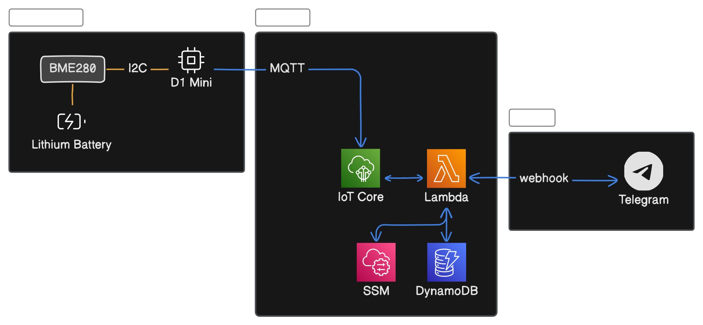

# GeniusHome

## Overall Architecture

## Implemented Features

- Subscribe to and unsubscribe from notifications

## Cost Analysis

### Hardware

- Sensors
- Micro-controllers
- Batteries

### AWS

Most service usages are within [AWS Always Free Tier](https://aws.amazon.com/free). For the remaining, you may estimate their cost using [AWS Pricing Calculator](https://calculator.aws/#/).

- User facing

| Service         | Purpose             | Always Free Tier | Monthly Cost        |
| --------------- | ------------------- | ---------------- | ------------------- |
| Lambda          | serverless compute  | ✅               | 0                   |
| DynamoDB        | data storage        | ✅               | 0                   |
| Systems Manager | parameter storage   | ✅               | 0                   |
| IoT Core        | device connectivity | ❌               | SGD 0.08 (USD 0.06) |

- Developer facing

| Service        | Purpose                | Always Free Tier | Monthly Cost |
| -------------- | ---------------------- | ---------------- | ------------ |
| CloudWatch     | performance monitoring | ?                | ?            |
| CloudFormation | infrastructure as code | ✅               | 0            |
| S3             | infrastructure as code | ❌               | ?            |
| CloudTrial     | account management     | ?                | ?            |

### Telegram

No cost involved.
