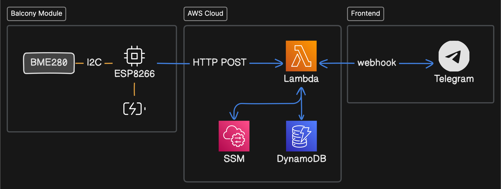

# GeniusHome

## Overall Architecture

## Implemented Features

- Subscribe to and unsubscribe from notifications

## Cost

### Hardware

- Sensors

  | Device Model | Purpose                                                   | Quantity | Unit Price (SGD) |
  | ------------ | --------------------------------------------------------- | -------- | ---------------- |
  | BME280       | Measuring temperature, air pressure and relative humidity | 1        | $3.82            |

- Micro-controllers

- Batteries

- 3D printing

### AWS

- User facing

  | Service         | Purpose             | [Always Free Tier](https://aws.amazon.com/free) | [Monthly Cost (SGD)](https://calculator.aws/#/) |
  | --------------- | ------------------- | ----------------------------------------------- | ----------------------------------------------- |
  | IoT Core        | device connectivity | ❌                                              | $0.08                                           |
  | Lambda          | serverless compute  | ✅                                              | 0                                               |
  | DynamoDB        | data storage        | ✅                                              | 0                                               |
  | Systems Manager | parameter storage   | ✅                                              | 0                                               |

- Developer facing

  | Service        | Purpose                | [Always Free Tier](https://aws.amazon.com/free) | [Monthly Cost (SGD)](https://calculator.aws/#/) |
  | -------------- | ---------------------- | ----------------------------------------------- | ----------------------------------------------- |
  | S3             | infrastructure as code | ❌                                              | ?                                               |
  | CloudFormation | infrastructure as code | ✅                                              | 0                                               |
  | CloudWatch     | performance monitoring | ✅                                              | 0                                               |

### Telegram

No cost involved.
